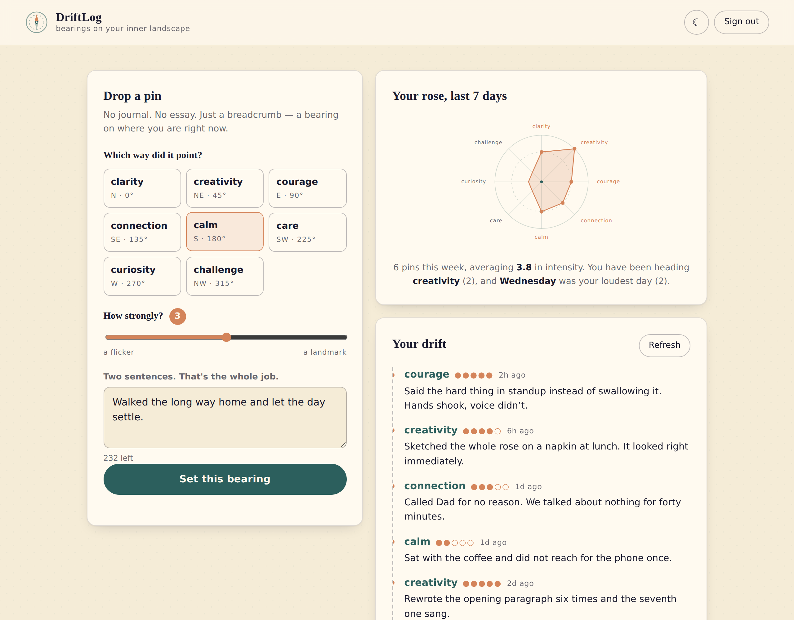
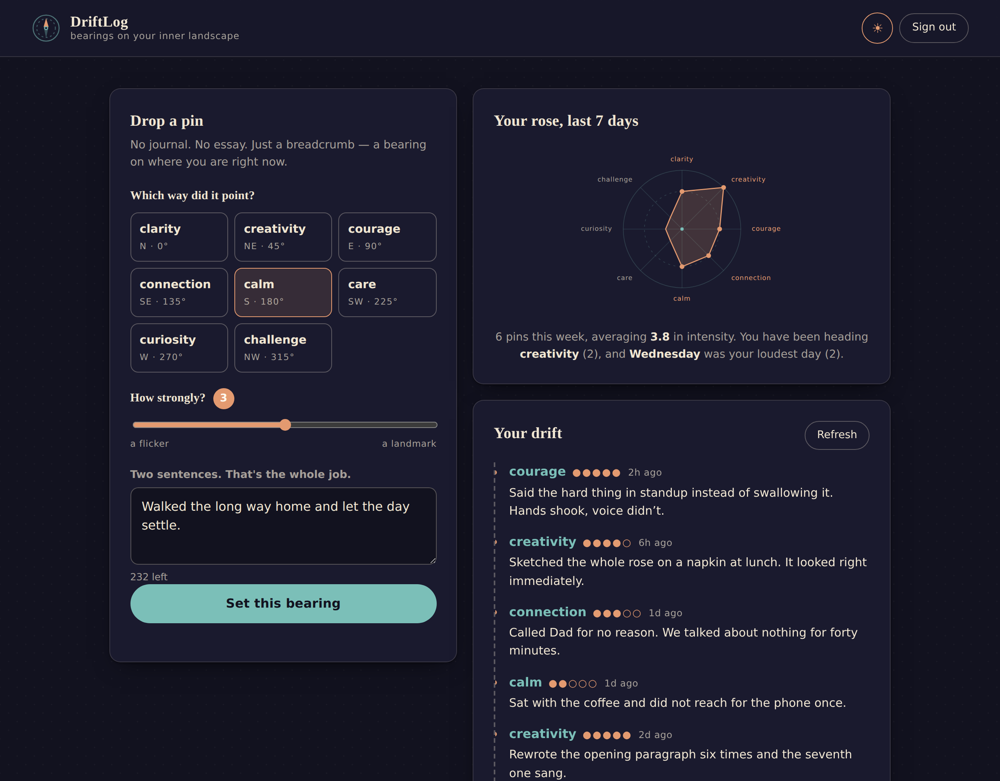

# DriftLog

**The app that turns your daily wandering into a living map of who you're becoming.**

Most compass apps point you somewhere. DriftLog flips the metaphor and asks
*where have you already been, emotionally?* You drop a timestamped pin — not on a
place, but on a feeling, a breakthrough, a small win — and over time the shape of
your compass rose reveals the direction your life is actually heading, not the one
you planned.

Built for **The Full Stack Challenge** (word: **COMPASS**) on AWS, with Terraform.

| Day | Night |
| --- | --- |
|  |  |

---

## What it does

- **Moment mapping.** Pick one of eight bearings (clarity N, creativity NE,
  courage E, connection SE, calm S, care SW, curiosity W, challenge NW), set an
  intensity from 1 to 5, write two sentences. Ten seconds, start to finish.
- **Your rose.** The last seven days of pins are drawn as a compass rose, so the
  direction you've been drifting is a shape rather than a spreadsheet.
- **Your drift.** A timeline of every pin, newest first, with relative times.
- **Day and night.** A full dark theme that follows your OS until you override it
  — the challenge curve ball.

## Architecture

```
                    ┌────────────────────┐
  Browser  ────────▶│    CloudFront      │  static site, HTTPS, global CDN
  (no build,        │  + Origin Access   │
   no framework)    │      Control       │
                    └─────────┬──────────┘
                              │  private origin
                    ┌─────────▼──────────┐
                    │   S3 (private)     │  index.html, app.js, styles.css,
                    └────────────────────┘  config.js (rendered by Terraform)

  Browser ──sign in/up──────▶ Amazon Cognito User Pool   (JSON API, no SDK)
          ──Bearer ID token─▶ API Gateway HTTP API
                                 │ JWT authorizer validates against the pool
                                 ▼
                             AWS Lambda (Node 22, arm64)
                                 │ least-privilege IAM: PutItem/Query/DeleteItem
                                 ▼
                             Amazon DynamoDB  (single table, on-demand)
                                 pk = USER#<sub>
                                 sk = PIN#<ISO timestamp>#<uuid>
```

**AWS services:** CloudFront, S3, Cognito, API Gateway (HTTP API), Lambda,
DynamoDB, IAM, CloudWatch Logs. **IaC:** Terraform.

### Why this shape

- **Single-table DynamoDB.** Sorting by `sk` sorts by time for free, so the
  timeline is one `Query` and "last seven days" is the same `Query` with a `>=`.
  On-demand billing keeps a hackathon-sized workload inside the free tier.
- **HTTP API over REST API.** Cheaper, faster, and its built-in JWT authorizer
  validates Cognito tokens without a custom authorizer Lambda.
- **Zero dependencies, end to end.** The Lambda uses the AWS SDK v3 that ships
  inside the Node 22 runtime; the frontend is vanilla ES2022 talking to Cognito's
  JSON API directly. No bundler, no `node_modules`, no lockfile drift — which
  means `terraform apply` really is the entire deploy.
- **Private bucket.** S3 is reachable only through CloudFront via an Origin
  Access Control; the bucket blocks all public access.

## Deploy

Prerequisites: Terraform ≥ 1.6 and AWS credentials with permission to create the
services above.

```bash
cd infra
cp terraform.tfvars.example terraform.tfvars   # optional; defaults work
terraform init
terraform apply
```

Terraform zips the Lambda, creates every resource, renders `config.js` with the
live resource ids and uploads the whole site. When it finishes:

```bash
terraform output app_url
```

Open that URL, create an account (Cognito emails a six-digit code), and drop your
first pin. CloudFront takes a few minutes to finish propagating on the very first
apply.

To tear it all down: `terraform destroy`.

### Redeploying after a change

`terraform apply` again. `index.html` and `config.js` are uploaded with
`no-cache`, and the rest with a 60-second TTL, so changes appear without a manual
invalidation. If you want one anyway:

```bash
aws cloudfront create-invalidation \
  --distribution-id "$(terraform output -raw cloudfront_distribution_id)" \
  --paths '/*'
```

## Develop locally

```bash
./scripts/dev.sh        # writes web/config.js from Terraform outputs, serves :5173
```

`http://localhost:5173` is already in the API's allowed CORS origins, so the local
site talks to the deployed backend. Requires `python3` — nothing else.

## Tests

```bash
node tests/api.test.mjs     # Lambda handler: routing, validation, tenant scoping
node tests/smoke.mjs        # full UI in headless Chromium, AWS stubbed at the wire
```

`api.test.mjs` swaps the AWS SDK for in-memory fakes using Node's module
resolution hooks, so the file under test is the exact one Terraform ships — no
test-only branches. `smoke.mjs` needs Playwright
(`npm i -g playwright && npx playwright install chromium`); it drives the real
static site with Cognito and the API stubbed at the network layer, covering
sign-in, the pin POST payload, timeline rendering, delete, session persistence and
the dark-mode toggle.

## Layout

```
backend/src/index.mjs     the whole API — one Lambda, four routes
web/                      index.html, app.js, styles.css, favicon.svg
web/config.js.tftpl       rendered by Terraform with the live resource ids
infra/                    Terraform: dynamodb, cognito, lambda, apigw, frontend
scripts/dev.sh            local dev server
tests/                    handler unit tests + browser smoke test
```

## Cost and limits

Everything is on-demand or free-tier-friendly. Two things to know before this
carries real traffic:

- Cognito's default email sender is capped at ~50 messages per day. Wire up SES in
  `infra/cognito.tf` before that matters.
- The API is throttled to 25 requests/second with a burst of 50 — deliberate for a
  public demo, easy to raise in `infra/apigw.tf`.

## Licence

MIT — see [LICENSE](LICENSE).
